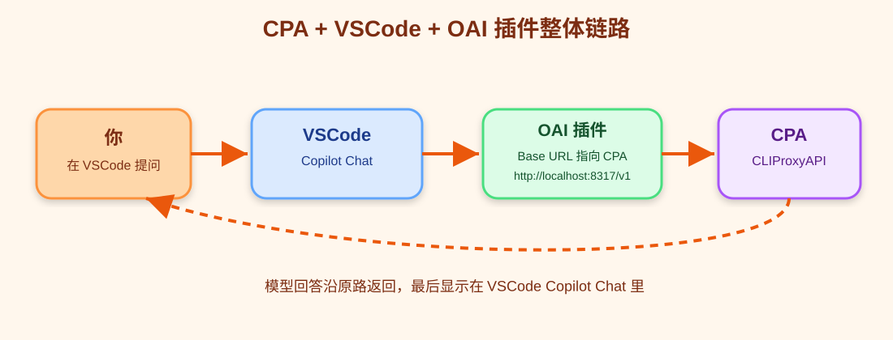
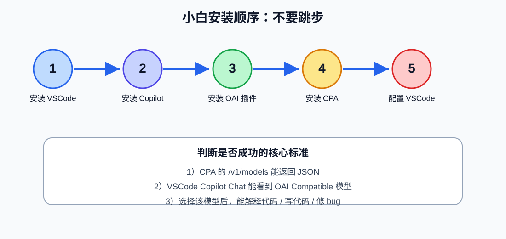
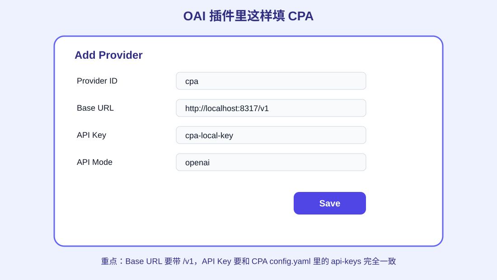
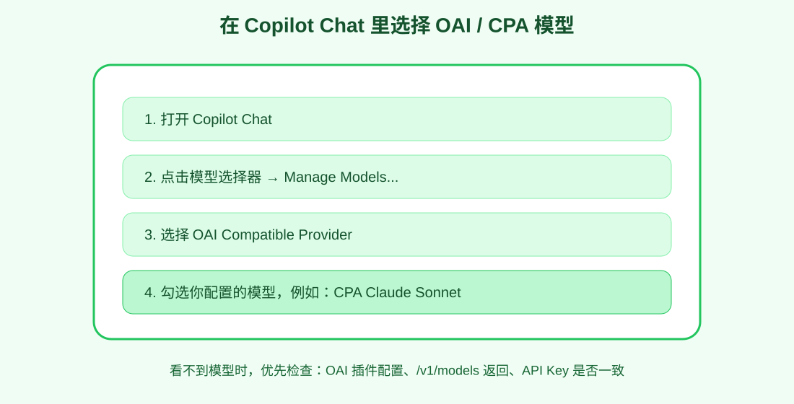
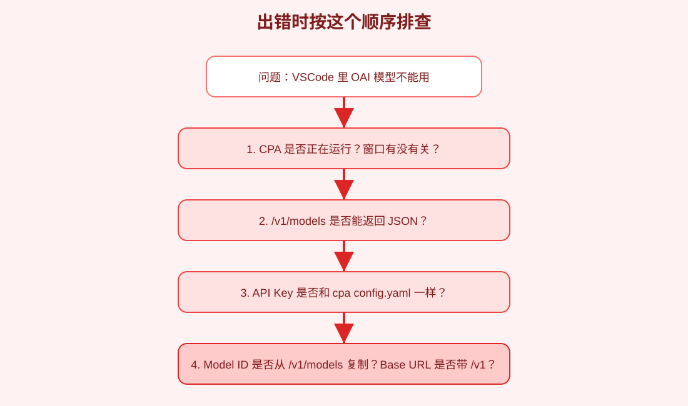

# CPA + VSCode + OAI Compatible Provider for Copilot 超级无敌小白教程 🐣💻

> 目标：让 VSCode 里的 GitHub Copilot Chat 使用 `OAI Compatible Provider for Copilot` 插件，通过本机 CLIProxyAPI（CPA）来调用模型，然后在 VSCode 里聊天、解释代码、生成代码、改代码。

这份教程写给“啥都不会的小白”：

- 不默认你懂 VSCode；
- 不默认你懂插件；
- 不默认你懂 API；
- 不默认你懂 `localhost`；
- 不默认你懂 `baseUrl`；
- 每一步都会写：点哪里、填什么、看到什么算成功、失败怎么办。


---

## 配图速览：先看图再操作 🖼️

> 用户提供的知乎参考文：<https://zhuanlan.zhihu.com/p/1951238505524093197>  
> 说明：该页面当前对自动抓取返回 403，无法稳定获取原图；为避免误搬不可确认授权的图片，本仓库改为放置自制配图，并保留原文链接作为参考。

### 1）整体链路图



### 2）安装顺序图



### 3）OAI Provider 关键配置图



### 4）Copilot Chat 选择模型图



### 5）排错流程图



---

## 目录

- [0. 最终你要做成什么样？](#0-最终你要做成什么样)
- [1. 先认识几个名字](#1-先认识几个名字)
- [2. 你需要准备什么](#2-你需要准备什么)
- [3. 安装 VSCode](#3-安装-vscode)
- [4. 安装 GitHub Copilot / Copilot Chat](#4-安装-github-copilot--copilot-chat)
- [5. 安装 OAI Compatible Provider for Copilot 插件](#5-安装-oai-compatible-provider-for-copilot-插件)
- [6. 安装并启动 CPA](#6-安装并启动-cpa)
- [7. 测试 CPA 的 OpenAI 兼容接口](#7-测试-cpa-的-openai-兼容接口)
- [8. 在 VSCode 里配置 OAI 插件连接 CPA](#8-在-vscode-里配置-oai-插件连接-cpa)
- [9. 在 Copilot Chat 里选择 OAI 模型](#9-在-copilot-chat-里选择-oai-模型)
- [10. 第一次用 VSCode + CPA 写代码](#10-第一次用-vscode--cpa-写代码)
- [11. 以后每天怎么用](#11-以后每天怎么用)
- [12. Windows / macOS / Linux 完整路线](#12-windows--macos--linux-完整路线)
- [13. 常见问题 FAQ](#13-常见问题-faq)
- [14. 安全提醒](#14-安全提醒)
- [15. 最短总结](#15-最短总结)

---

## 0. 最终你要做成什么样？

最终链路是：

```text
你打开 VSCode
    ↓
你打开 Copilot Chat
    ↓
你选择 OAI Compatible 模型
    ↓
VSCode 插件请求 http://localhost:8317/v1/chat/completions
    ↓
CLIProxyAPI 收到请求
    ↓
CPA 转发到对应模型
    ↓
模型回答
    ↓
VSCode Copilot Chat 显示答案
```

小白理解版：

- VSCode 是写代码的软件；
- Copilot Chat 是 VSCode 里的聊天窗口；
- OAI Compatible Provider for Copilot 是“让 Copilot Chat 可以用第三方 OpenAI 兼容接口”的插件；
- CPA 是你电脑上的本地模型中转站；
- 我们要把插件的接口地址填成 CPA 的地址。

---

## 1. 先认识几个名字

### 1.1 VSCode 是什么？

VSCode 全名 Visual Studio Code。

它是一个很常见的代码编辑器。

你可以用它：

- 写 Python；
- 写 JavaScript；
- 写网页；
- 管理项目文件；
- 安装插件；
- 使用 Copilot Chat 问 AI。

---

### 1.2 Copilot Chat 是什么？

Copilot Chat 是 VSCode 里的 AI 聊天功能。

你可以问它：

```text
解释这个函数
```

```text
帮我写一个 Python 爬虫
```

```text
帮我修复这个报错
```

```text
根据当前项目生成 README
```

---

### 1.3 OAI Compatible Provider for Copilot 是什么？

这是一个 VSCode 插件。

插件名：

```text
OAI Compatible Provider for Copilot
```

Marketplace 地址：

<https://marketplace.visualstudio.com/items?itemName=johnny-zhao.oai-compatible-copilot>

它的作用：

> 让 Copilot Chat 能使用 OpenAI-compatible 的接口。

CPA 正好提供 OpenAI-compatible 接口，所以它们可以连起来。

---

### 1.4 CPA 是什么？

CPA = CLIProxyAPI。

它启动后通常会在本机开一个服务：

```text
http://localhost:8317
```

其中 OpenAI 兼容接口一般是：

```text
http://localhost:8317/v1
```

聊天接口是：

```text
http://localhost:8317/v1/chat/completions
```

你不用手动访问最后这个接口，插件会自动请求。

---

### 1.5 localhost 是什么？

`localhost` 就是“你这台电脑自己”。

```text
http://localhost:8317
```

意思是：

> 访问你自己电脑上 8317 端口运行的服务。

所以 CPA 和 VSCode 最好在同一台电脑上运行。

---

## 2. 你需要准备什么

### 必备

1. 一台电脑；
2. VSCode；
3. GitHub Copilot / Copilot Chat 能正常打开；
4. `OAI Compatible Provider for Copilot` 插件；
5. CPA，也就是 CLIProxyAPI；
6. 一个 CPA 能调用的模型来源，比如 Claude / Gemini / GPT / Qwen 等；
7. 能打开终端。

### 建议

- 先在本机运行 CPA，不要一开始搞远程服务器；
- 先使用 `localhost:8317`；
- 先用一个模型跑通，不要一开始配一堆模型。

---

## 3. 安装 VSCode

### 3.1 打开官网

打开：

<https://code.visualstudio.com/>

### 3.2 下载

官网会自动识别你的系统。

点击 Download。

### 3.3 Windows 安装

下载 `.exe` 后双击。

推荐勾选：

```text
Add to PATH
```

如果看到这些选项，也建议勾上：

```text
Open with Code
Register Code as editor
```

一路 Next 安装即可。

### 3.4 macOS 安装

下载 `.zip` 后解压。

把 `Visual Studio Code.app` 拖进“应用程序”。

然后从启动台打开 VSCode。

### 3.5 Linux 安装

Ubuntu / Debian 通常下载 `.deb`。

安装：

```bash
sudo apt install ./code_*.deb
```

也可以按 VSCode 官网的 Linux 教程安装。

### 3.6 检查是否成功

打开 VSCode。

看到欢迎页面就成功。

---

## 4. 安装 GitHub Copilot / Copilot Chat

> 注意：`OAI Compatible Provider for Copilot` 是接到 Copilot Chat 里的，所以你需要 VSCode 的 Copilot Chat 能用。

### 4.1 打开插件市场

在 VSCode 左侧，找到一个像积木块一样的图标。

这个叫 Extensions，中文可能叫“扩展”。

快捷键：

- Windows / Linux：`Ctrl + Shift + X`
- macOS：`Cmd + Shift + X`

### 4.2 搜索 Copilot

搜索：

```text
GitHub Copilot
```

安装：

- GitHub Copilot
- GitHub Copilot Chat

有些版本会合并显示，看到官方 GitHub 出品即可。

### 4.3 登录 GitHub

安装后，VSCode 可能提示你登录 GitHub。

点登录。

浏览器打开后按提示授权。

### 4.4 检查 Copilot Chat

VSCode 左侧应该能看到 Chat / Copilot 图标。

也可以按：

- Windows / Linux：`Ctrl + Shift + I`
- macOS：`Cmd + Shift + I`

如果能打开聊天窗口，说明 Copilot Chat 基础功能正常。

> 如果你是 Copilot Business / Enterprise 用户，请注意：OAI Compatible Provider 官方说明当前可能不支持 Business / Enterprise 场景。个人账号更适合先测试。

---

## 5. 安装 OAI Compatible Provider for Copilot 插件

### 5.1 打开扩展市场

快捷键：

- Windows / Linux：`Ctrl + Shift + X`
- macOS：`Cmd + Shift + X`

### 5.2 搜索插件名

搜索：

```text
OAI Compatible Provider for Copilot
```

插件作者/标识通常是：

```text
johnny-zhao.oai-compatible-copilot
```

### 5.3 点击 Install

点 Install / 安装。

安装完成后，VSCode 右下角可能出现：

```text
OAICopilot
```

如果没看到，也没关系，后面可以用命令面板打开配置。

---

## 6. 安装并启动 CPA

这一节只写能让 VSCode 接上的最小流程。

如果你已经装好 CPA，并且 `http://localhost:8317/v1/models` 能通，可以跳到下一节。

---

### 6.1 Windows 安装 CPA

#### 第 1 步：下载

打开：

<https://github.com/router-for-me/CLIProxyAPI/releases>

下载 Windows 版本。

普通 Windows 电脑一般选择带这些字样的文件：

```text
windows
amd64
x86_64
```

#### 第 2 步：解压

建议解压到：

```text
C:\cli-proxy-api
```

#### 第 3 步：创建配置

打开 PowerShell：

```powershell
mkdir C:\cli-proxy-api\data
notepad C:\cli-proxy-api\config.yaml
```

复制进去：

```yaml
port: 8317
auth-dir: "C:/cli-proxy-api/data"
debug: false
request-retry: 3
api-keys:
  - "cpa-local-key"
```

保存。

#### 第 4 步：登录你要用的模型账号

如果你要用 Claude OAuth：

```powershell
cd C:\cli-proxy-api
.\cli-proxy-api.exe --claude-login --config C:\cli-proxy-api\config.yaml
```

如果你要用 Codex / GPT OAuth：

```powershell
cd C:\cli-proxy-api
.\cli-proxy-api.exe --codex-login --config C:\cli-proxy-api\config.yaml
```

如果没有浏览器自动打开，可以加：

```powershell
--no-browser
```

#### 第 5 步：启动 CPA

```powershell
cd C:\cli-proxy-api
.\cli-proxy-api.exe --config C:\cli-proxy-api\config.yaml
```

这个窗口不要关。

---

### 6.2 macOS 安装 CPA

安装：

```bash
brew install cliproxyapi
```

创建配置：

```bash
mkdir -p ~/.cli-proxy-api
nano ~/.cli-proxy-api/config.yaml
```

内容：

```yaml
port: 8317
auth-dir: "~/.cli-proxy-api"
debug: false
request-retry: 3
api-keys:
  - "cpa-local-key"
```

登录 Claude：

```bash
cli-proxy-api --claude-login --config ~/.cli-proxy-api/config.yaml
```

如果你的命令叫 `cliproxyapi`，就用：

```bash
cliproxyapi --claude-login --config ~/.cli-proxy-api/config.yaml
```

启动：

```bash
cli-proxy-api --config ~/.cli-proxy-api/config.yaml
```

或者：

```bash
cliproxyapi --config ~/.cli-proxy-api/config.yaml
```

启动窗口不要关。

---

### 6.3 Linux 安装 CPA

一键安装：

```bash
curl -fsSL https://raw.githubusercontent.com/brokechubb/cliproxyapi-installer/refs/heads/master/cliproxyapi-installer | bash
```

创建配置：

```bash
mkdir -p ~/.cli-proxy-api
nano ~/.cli-proxy-api/config.yaml
```

内容：

```yaml
port: 8317
auth-dir: "~/.cli-proxy-api"
debug: false
request-retry: 3
api-keys:
  - "cpa-local-key"
```

登录 Claude：

```bash
cli-proxy-api --claude-login --config ~/.cli-proxy-api/config.yaml
```

启动 CPA：

```bash
cli-proxy-api --config ~/.cli-proxy-api/config.yaml
```

启动窗口不要关。

---

## 7. 测试 CPA 的 OpenAI 兼容接口

VSCode 插件要访问的是 OpenAI-compatible 接口。

CPA 默认 OpenAI 兼容 base URL 是：

```text
http://localhost:8317/v1
```

我们先测试它。

---

### 7.1 Windows 测试

新开一个 PowerShell，不要关闭 CPA 窗口。

```powershell
curl.exe http://localhost:8317/v1/models -H "Authorization: Bearer cpa-local-key"
```

### 7.2 macOS / Linux 测试

新开一个终端，不要关闭 CPA 窗口。

```bash
curl http://localhost:8317/v1/models \
  -H "Authorization: Bearer cpa-local-key"
```

---

### 7.3 什么结果算成功？

你看到 JSON 就算 CPA 有响应。

例如：

```json
{
  "object": "list",
  "data": [
    {
      "id": "claude-sonnet-4-20250514"
    }
  ]
}
```

或者模型列表格式略有不同也没关系。

重点：

- 不应该是连接失败；
- 不应该是 401；
- 不应该是空白没反应。

---

## 8. 在 VSCode 里配置 OAI 插件连接 CPA

这一节是重点。

我们要告诉 `OAI Compatible Provider for Copilot`：

```text
baseUrl = http://localhost:8317/v1
apiKey = cpa-local-key
model = 你 CPA 里能用的模型名
apiMode = openai
```

---

### 8.1 推荐方式：用配置 UI

#### 第 1 步：打开命令面板

快捷键：

- Windows / Linux：`Ctrl + Shift + P`
- macOS：`Cmd + Shift + P`

#### 第 2 步：搜索配置界面

输入：

```text
OAICopilot: Open Configuration UI
```

点进去。

如果没搜到，说明插件可能没装好，回到第 5 步检查。

---

### 8.2 添加 Provider

在配置 UI 里找到 Provider Management 或类似区域。

点击：

```text
Add Provider
```

按下面填：

| 项目 | 填什么 |
|---|---|
| Provider ID | `cpa` |
| Base URL | `http://localhost:8317/v1` |
| API Key | `cpa-local-key` |
| API Mode | `openai` |

然后点击 Save / 保存。

---

### 8.3 添加 Model

点击：

```text
Add Model
```

按下面填一个最小可用模型。

如果你的 CPA 模型列表里有：

```text
claude-sonnet-4-20250514
```

就填：

| 项目 | 填什么 |
|---|---|
| Provider | `cpa` |
| Model ID | `claude-sonnet-4-20250514` |
| Display Name | `CPA Claude Sonnet` |
| API Mode | `openai` |
| Context Length | `128000` |
| Max Tokens | `8192` |
| Temperature | `0` |
| Top P | `1` |

然后保存。

如果你用的是 GPT 模型，例如：

```text
gpt-5
```

那 Model ID 就填：

```text
gpt-5
```

Display Name 可以写：

```text
CPA GPT-5
```

---

### 8.4 不确定模型名怎么办？

回到第 7 步，查模型列表。

Windows：

```powershell
curl.exe http://localhost:8317/v1/models -H "Authorization: Bearer cpa-local-key"
```

macOS / Linux：

```bash
curl http://localhost:8317/v1/models \
  -H "Authorization: Bearer cpa-local-key"
```

看返回里的 `id`。

插件里的 Model ID 必须和 `id` 一样。

---

### 8.5 手动 settings.json 配置方式

如果你不用 UI，也可以直接改 VSCode 设置 JSON。

打开命令面板：

- Windows / Linux：`Ctrl + Shift + P`
- macOS：`Cmd + Shift + P`

搜索：

```text
Preferences: Open User Settings (JSON)
```

加入配置：

```json
{
  "oaicopilot.baseUrl": "http://localhost:8317/v1",
  "oaicopilot.models": [
    {
      "id": "claude-sonnet-4-20250514",
      "owned_by": "cpa",
      "displayName": "CPA Claude Sonnet",
      "apiMode": "openai",
      "context_length": 128000,
      "max_tokens": 8192,
      "temperature": 0,
      "top_p": 1
    }
  ]
}
```

然后还需要设置 API Key。

打开命令面板，搜索：

```text
OAICopilot: Set OAI Compatible Multi-Provider API Key
```

选择 provider：

```text
cpa
```

输入：

```text
cpa-local-key
```

---

### 8.6 为什么 baseUrl 要写 /v1？

CPA 的服务根地址是：

```text
http://localhost:8317
```

OpenAI 兼容 API 一般在：

```text
http://localhost:8317/v1
```

OAI 插件会在后面自动拼：

```text
/chat/completions
```

所以最终请求会变成：

```text
http://localhost:8317/v1/chat/completions
```

这正是 CPA 的 OpenAI 兼容聊天接口。

---

## 9. 在 Copilot Chat 里选择 OAI 模型

配置完后，还要让 Copilot Chat 使用你添加的模型。

### 第 1 步：打开 Copilot Chat

快捷键：

- Windows / Linux：`Ctrl + Shift + I`
- macOS：`Cmd + Shift + I`

或者点 VSCode 左侧 Chat / Copilot 图标。

### 第 2 步：找到模型选择器

在聊天输入框附近，通常会有模型名或模型选择下拉框。

点击它。

### 第 3 步：Manage Models

选择：

```text
Manage Models...
```

### 第 4 步：选择 OAI Compatible

找到：

```text
OAI Compatible
```

### 第 5 步：勾选你的模型

勾选刚才添加的模型，比如：

```text
CPA Claude Sonnet
```

或者：

```text
CPA GPT-5
```

保存。

### 第 6 步：回到聊天窗口选择模型

回到 Copilot Chat 模型选择器，选择你的 CPA 模型。

---

## 10. 第一次用 VSCode + CPA 写代码

现在开始实际测试。

---

### 10.1 创建测试文件夹

在 VSCode：

1. 点击 File / 文件；
2. 点击 Open Folder / 打开文件夹；
3. 新建一个文件夹，例如：

```text
cpa-vscode-test
```

4. 打开它。

---

### 10.2 创建一个 Python 文件

在左侧文件区，点击 New File。

文件名：

```text
hello.py
```

写入：

```python
print("hello")
```

保存。

---

### 10.3 让 Copilot Chat 解释代码

打开 Copilot Chat，确保模型选择的是你的 OAI / CPA 模型。

输入：

```text
请解释当前 hello.py 是做什么的，用小白能听懂的话说明。
```

如果它能回答，说明 VSCode → OAI 插件 → CPA → 模型 这条链路通了。

---

### 10.4 让它写代码

输入：

```text
请帮我把 hello.py 改成一个简单的 Python 计算器，支持加减乘除，并解释每一行代码。
```

如果它给出代码，或者能帮你修改文件，说明可以正常写代码。

---

### 10.5 让它修 bug

把 `hello.py` 改成：

```python
a = 1
b = 0
print(a / b)
```

然后问：

```text
这个代码为什么会报错？请帮我修复，并解释原因。
```

如果它能指出除以 0，并给出修复方案，说明基础开发体验正常。

---

## 11. 以后每天怎么用

每天使用顺序：

### 第 1 步：启动 CPA

Windows：

```powershell
cd C:\cli-proxy-api
.\cli-proxy-api.exe --config C:\cli-proxy-api\config.yaml
```

macOS / Linux：

```bash
cli-proxy-api --config ~/.cli-proxy-api/config.yaml
```

这个窗口不要关。

### 第 2 步：打开 VSCode

打开你的项目文件夹。

### 第 3 步：打开 Copilot Chat

快捷键：

- Windows / Linux：`Ctrl + Shift + I`
- macOS：`Cmd + Shift + I`

### 第 4 步：选择 OAI / CPA 模型

在模型选择器里选择：

```text
CPA Claude Sonnet
```

或你自己配置的模型。

### 第 5 步：开始问它

例如：

```text
请阅读当前项目，告诉我入口文件在哪里。
```

```text
帮我实现登录接口。
```

```text
帮我检查这个报错。
```

---

## 12. Windows / macOS / Linux 完整路线

---

### 12.1 Windows 完整路线

1. 安装 VSCode：<https://code.visualstudio.com/>
2. 安装 GitHub Copilot / Copilot Chat；
3. 安装 OAI Compatible Provider for Copilot；
4. 下载 CPA：<https://github.com/router-for-me/CLIProxyAPI/releases>
5. 解压到：

```text
C:\cli-proxy-api
```

6. 创建配置：

```powershell
mkdir C:\cli-proxy-api\data
notepad C:\cli-proxy-api\config.yaml
```

内容：

```yaml
port: 8317
auth-dir: "C:/cli-proxy-api/data"
debug: false
request-retry: 3
api-keys:
  - "cpa-local-key"
```

7. 登录 Claude：

```powershell
cd C:\cli-proxy-api
.\cli-proxy-api.exe --claude-login --config C:\cli-proxy-api\config.yaml
```

8. 启动 CPA：

```powershell
cd C:\cli-proxy-api
.\cli-proxy-api.exe --config C:\cli-proxy-api\config.yaml
```

9. 新开 PowerShell 测试：

```powershell
curl.exe http://localhost:8317/v1/models -H "Authorization: Bearer cpa-local-key"
```

10. VSCode OAI 插件配置：

```text
Provider ID: cpa
Base URL: http://localhost:8317/v1
API Key: cpa-local-key
API Mode: openai
Model ID: 从 /v1/models 返回里选一个
```

---

### 12.2 macOS 完整路线

1. 安装 VSCode；
2. 安装 Copilot / Copilot Chat；
3. 安装 OAI Compatible Provider for Copilot；
4. 安装 CPA：

```bash
brew install cliproxyapi
```

5. 创建配置：

```bash
mkdir -p ~/.cli-proxy-api
nano ~/.cli-proxy-api/config.yaml
```

内容：

```yaml
port: 8317
auth-dir: "~/.cli-proxy-api"
debug: false
request-retry: 3
api-keys:
  - "cpa-local-key"
```

6. 登录 Claude：

```bash
cli-proxy-api --claude-login --config ~/.cli-proxy-api/config.yaml
```

或者：

```bash
cliproxyapi --claude-login --config ~/.cli-proxy-api/config.yaml
```

7. 启动 CPA：

```bash
cli-proxy-api --config ~/.cli-proxy-api/config.yaml
```

8. 新开终端测试：

```bash
curl http://localhost:8317/v1/models \
  -H "Authorization: Bearer cpa-local-key"
```

9. VSCode OAI 插件配置：

```text
Provider ID: cpa
Base URL: http://localhost:8317/v1
API Key: cpa-local-key
API Mode: openai
Model ID: 从 /v1/models 返回里选一个
```

---

### 12.3 Linux 完整路线

1. 安装 VSCode；
2. 安装 Copilot / Copilot Chat；
3. 安装 OAI Compatible Provider for Copilot；
4. 安装 CPA：

```bash
curl -fsSL https://raw.githubusercontent.com/brokechubb/cliproxyapi-installer/refs/heads/master/cliproxyapi-installer | bash
```

5. 创建配置：

```bash
mkdir -p ~/.cli-proxy-api
nano ~/.cli-proxy-api/config.yaml
```

内容：

```yaml
port: 8317
auth-dir: "~/.cli-proxy-api"
debug: false
request-retry: 3
api-keys:
  - "cpa-local-key"
```

6. 登录 Claude：

```bash
cli-proxy-api --claude-login --config ~/.cli-proxy-api/config.yaml
```

7. 启动 CPA：

```bash
cli-proxy-api --config ~/.cli-proxy-api/config.yaml
```

8. 新开终端测试：

```bash
curl http://localhost:8317/v1/models \
  -H "Authorization: Bearer cpa-local-key"
```

9. VSCode OAI 插件配置：

```text
Provider ID: cpa
Base URL: http://localhost:8317/v1
API Key: cpa-local-key
API Mode: openai
Model ID: 从 /v1/models 返回里选一个
```

---

## 13. 常见问题 FAQ

### Q1：VSCode 里搜不到 OAI 插件怎么办？

确认你搜的是：

```text
OAI Compatible Provider for Copilot
```

也可以直接打开 Marketplace：

<https://marketplace.visualstudio.com/items?itemName=johnny-zhao.oai-compatible-copilot>

然后点击 Install。

---

### Q2：命令面板里没有 `OAICopilot: Open Configuration UI`

可能原因：

1. 插件没装好；
2. VSCode 没重启；
3. 插件版本太旧；
4. VSCode 版本低于插件要求。

解决：

- 重启 VSCode；
- 更新 VSCode；
- 重新安装插件。

---

### Q3：CPA 的 `/v1/models` 连接失败

说明 CPA 没启动或端口不对。

检查：

- CPA 启动窗口还在吗？
- 是否报错退出了？
- 配置里的端口是不是 `8317`？
- 测试地址是不是 `http://localhost:8317/v1/models`？

---

### Q4：返回 401 Unauthorized

说明 API Key 不对。

CPA 配置：

```yaml
api-keys:
  - "cpa-local-key"
```

VSCode 插件里 API Key 也必须填：

```text
cpa-local-key
```

---

### Q5：模型选择器里看不到 OAI 模型

按顺序检查：

1. OAI 插件是否安装；
2. 是否已经 Add Provider；
3. 是否已经 Add Model；
4. 是否在 Copilot Chat 里点了 `Manage Models...`；
5. 是否选择了 `OAI Compatible` provider；
6. 是否勾选了你的模型。

---

### Q6：模型请求失败，提示模型不存在

插件里填的 Model ID 必须和 CPA `/v1/models` 返回的模型 ID 一样。

先查：

```bash
curl http://localhost:8317/v1/models -H "Authorization: Bearer cpa-local-key"
```

Windows：

```powershell
curl.exe http://localhost:8317/v1/models -H "Authorization: Bearer cpa-local-key"
```

复制返回里的模型 `id`，粘贴到插件 Model ID。

---

### Q7：应该用什么 API Mode？

连接 CPA 的 OpenAI 兼容接口时，建议用：

```text
openai
```

因为 CPA 提供 `/v1/chat/completions` 这类 OpenAI-compatible 接口。

---

### Q8：Base URL 应该填哪个？

填：

```text
http://localhost:8317/v1
```

不要只填：

```text
http://localhost:8317
```

因为 OAI 插件通常会基于 baseUrl 拼接 `/chat/completions`。

---

### Q9：CPA 和 VSCode 不在同一台电脑怎么办？

小白不建议一开始这样做。

如果非要这样，需要：

- CPA 监听外部地址；
- 防火墙放行端口；
- 强 API Key；
- 最好加 HTTPS / 反代 / 访问控制。

新手先用同一台电脑的：

```text
http://localhost:8317/v1
```

---

### Q10：为什么 Copilot Business / Enterprise 可能不能用？

OAI Compatible Provider 官方说明：当前不适用于 Copilot Business / Enterprise 用户场景。

如果你是企业版账号，遇到模型管理入口不可用，不一定是你配置错了。

建议先用个人版 Copilot 测试。

---

### Q11：我不想用 Claude，想用 GPT / Qwen 可以吗？

可以，只要 CPA 里有对应模型，并且 `/v1/models` 能看到。

你只需要在 OAI 插件里把 Model ID 改成对应模型。

例如：

```text
gpt-5
qwen3-coder-plus
```

具体以你的 CPA 返回为准。

---

## 14. 安全提醒

### 14.1 不要公开 CPA

新手只用：

```text
http://localhost:8317/v1
```

不要把 CPA 直接开放到公网。

### 14.2 不要泄露 API Key

教程里的：

```text
cpa-local-key
```

只是示例。

真实使用建议换成长随机字符串。

### 14.3 不要上传配置文件

不要把这些发到 GitHub：

```text
config.yaml
~/.cli-proxy-api
C:\cli-proxy-api\data
真实 API Key
token
cookie
```

### 14.4 截图要打码

截图时注意打码：

- API Key；
- 登录链接；
- token；
- cookie；
- 账号信息。

---

## 15. 最短总结

你只需要记住：

1. CPA 启动后，本地 OpenAI 兼容地址是：

```text
http://localhost:8317/v1
```

2. OAI 插件 Provider 这样填：

```text
Provider ID: cpa
Base URL: http://localhost:8317/v1
API Key: cpa-local-key
API Mode: openai
```

3. Model ID 从这里查：

```bash
curl http://localhost:8317/v1/models -H "Authorization: Bearer cpa-local-key"
```

4. Copilot Chat 里选择 `OAI Compatible` 模型后，就可以通过 CPA 写代码。

---

## 参考链接

- 知乎参考教程：<https://zhuanlan.zhihu.com/p/1951238505524093197>
- VSCode 官网：<https://code.visualstudio.com/>
- OAI Compatible Provider for Copilot：<https://marketplace.visualstudio.com/items?itemName=johnny-zhao.oai-compatible-copilot>
- OAI 插件 GitHub：<https://github.com/JohnnyZ93/oai-compatible-copilot>
- CLIProxyAPI GitHub：<https://github.com/router-for-me/CLIProxyAPI>
- CLIProxyAPI 文档：<https://help.router-for.me/>

---

由 **小凌虾** 整理维护。  
这份教程的原则是：让完全没碰过 CPA 和 VSCode AI 插件的人，也能照着一步一步跑通。🐾


## 参考图片

### 知乎参考长图（用户提供）

> 说明：这张图来自用户提供的知乎文章截图长图。由于当前长图分辨率较低（约 81×1280），其中部分代码/配置文字无法稳定辨认，所以这里先作为参考原图保留，避免误抄配置。


如果你手里有更高清的原图，可以替换这个文件：

```text
images/reference/zhihu-reference-long-image.jpg
```

